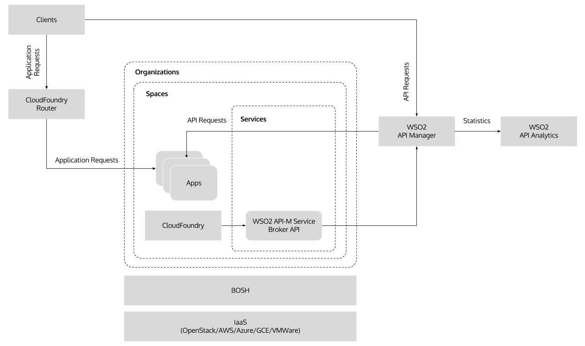

# WSO2 API Manager Pivotal Cloud Foundry Service Broker

This repository contains CloudFoundry (CF) service broker for WSO2 API Manager. The service broker API has been implemented using Ballerina and it can be run on CF as an application using Docker. The servce broker does not provision WSO2 API Manager, rather it points to an existing deployment.

Refer [Quick Start](#quick-start) for trying this out on a local machine with [PCF Dev](https://pivotal.io/pcf-dev) and [Installation](#installation) for installing this on an existing CF environment.

## Deployment Architecture

The following diagram illustrates the deployment architecture:


## Quick Start Prerequisites

The following prerequisites are needed for the quick start:

 - [PCF Dev v1.10](https://pivotal.io/platform/pcf-tutorials/getting-started-with-pivotal-cloud-foundry-dev/install-pcf-dev)
 - [Java Development Kit (JDK) 8](http://www.oracle.com/technetwork/java/javase/downloads/jdk8-downloads-2133151.html)
 - [WSO2 API Manager v2.1.0](http://wso2.com/api-management/) distribution
 - [Ballerina v0.89](https://ballerinalang.org/) runtime distribution

## Quick Start Guide

The quick start provides steps for installing WSO2 API Manager service broker on PCF Dev.

- Download and install PCF Dev by following [this PCF tutorial](https://pivotal.io/platform/pcf-tutorials/getting-started-with-pivotal-cloud-foundry-dev/install-pcf-dev).

- Start PCF Dev instance:
  
  ```bash
  $ cf dev start
  ```

- Download Ballerina tools distribution v0.89 from [ballerinalang.org](https://ballerinalang.org/) and add it's bin folder path to the PATH variable:
  
  ````bash
  $ export BAL_HOME="/path/to/ballerina/ballerina-tools-<version>/"
  $ export PATH=$BAL_HOME/bin:$PATH
  ````

- Download WSO2 API Manager 2.1.0 distribution from [wso2.com](http://wso2.com/api-management/), extract it and start the server:
   
  ````bash
  $ unzip wso2am-2.1.0.zip
  $ cd wso2am-2.1.0/ # refer this as WSO2_APIM_HOME
  $ bin/wso2server.sh start
  ````

- Clone this git repository:
  
  ````bash
  $ git clone https://github.com/wso2/cf-service-broker-apim.git
  ````

- Execute the following command to register an OAuth client application in WSO2 API Manager for invoking its admin API:

  ````bash
  $ curl -X POST -u <username>:<password> -H "Content-Type: application/json" -d '{
    "callbackUrl": "https://localhost/callback",
    "clientName": "wso2-apim-cf-service-broker",
    "tokenScope": "Production",
    "owner": "admin",
    "grantType": "password refresh_token",
    "saasApp": true
  }' http://<wso2-apim-hostname>:9763/client-registration/v0.11/register
  ````

- Expose following environment variables:

  ````bash
  $ export WSO2_APIM_TOKEN_ENDPOINT=https://<wso2-apim-hostname>:8243/token
  $ export WSO2_APIM_PUBLISHER_ENDPOINT=https://<wso2-apim-hostname>:9443/api/am/publisher
  $ export WSO2_APIM_PUBLISHER_UI_URL=https://<wso2-apim-hostname>:9443/publisher/
  $ export WSO2_APIM_CLIENT_ID=<client-id-generated-above>
  $ export WSO2_APIM_CLIENT_SECRET=<client-secret-generated-above>
  $ export WSO2_APIM_USERNAME=admin
  $ export WSO2_APIM_PASSWORD=admin
  ````

- Start the service broker API using Ballerina:
   
  ````bash
  $ cd /path/to/wso2-apim-service-broker/
  $ ballerina run service wso2apim/cf/servicebroker/
  ````

- Find the IP address of the local machine and verify the catalog resource:

  ````bash
  $ curl -v http://<service-broker-ip>:9090/v2/catalog
  ...
  > GET /v2/catalog HTTP/1.1
  > Host: localhost:9090
  > User-Agent: curl/7.51.0
  > Accept: */*
  >
  < HTTP/1.1 200 OK
  < Content-Type: application/json
  < Content-Length: 486
  <
  ...
  {"services":[{"id":"wso2-apim-service-broker","name":"wso2-apim","description":"WSO2 API-M service broker for Pivotal CloudFoundry","tags":["wso2","api"],"requires":[],"bindable":true,"metadata":{"provider":{"name":"WSO2"},"listing":{"imageUrl":"https://upload.wikimedia.org/wikipedia/en/5/56/WSO2_Software_Logo.png"}},"plan_updateable":false,"plans":[{"id":"1","name":"default","description":"Default plan without any costs","max_storage_tb":0,"metadata":{"costs":[],"bullets":[]}}]}]}
  ````

- Create WSO2 API-M service broker using the following command:

  ````bash
  $ cf create-service-broker wso2-apim <broker-service-api-username> <broker-service-api-password> http://<service-broker-ip>:9090 --space-scoped
  ````
  
- Find WSO2 API-M service name and plan name using the following command:

  ````bash
  $ cf marketplace
  Getting services from marketplace in org pcfdev-org / space pcfdev-space as admin...
  OK
  
  service                     plans             description
  wso2-apim                   default           WSO2 API-M service broker for Pivotal CloudFoundry
  local-volume                free-local-disk   Local service docs: https://github.com/cloudfoundry-incubator/local-volume-release/
  p-mysql                     512mb, 1gb        MySQL databases on demand
  p-rabbitmq                  standard          RabbitMQ is a robust and scalable high-performance multi-protocol messaging broker.
  p-redis                     shared-vm         Redis service to provide a key-value store
  
  TIP:  Use 'cf marketplace -s SERVICE' to view descriptions of individual plans of a given service.
  ````
  
- Create a WSO2 API-M service instance using the following command:
 
  ````bash
  $ cf create-service wso2-apim default wso2-apim
  Creating service instance wso2-apim in org pcfdev-org / space pcfdev-space as admin...
  OK
  ````

- Clone following git repository to deploy a sample microservice on PCF:
  ````bash
  git clone https://github.com/wso2/msf4j
  ````

- Build helloworld sample microservice using Maven:
  ````bash
  cd msf4j/samples/helloworld
  mvn clean install
  ````

- Deploy helloworld sample microservice on PCF:
  ````bash
  cf push hello-service -p target/helloworld-2.5.3-SNAPSHOT.jar
  ````

- List PCF applications using the following command:

  ````bash
  $ cf apps
  Getting apps in org pcfdev-org / space pcfdev-space as admin...
  OK

  name            requested state   instances   memory   disk   urls
  hello-service   started           1/1         256M     512M   hello-service.local.pcfdev.io
  ````

- Create an API definition JSON file with the following content:
  
  ````json
  {
    "apiName": "HelloAPI",
    "apiVersion": "v1.0",
    "contextPath": "/hello",
    "serviceEndpoint": "http://hello-service.local.pcfdev.io/hello",
    "serviceEndpointUsername": "admin",
    "serviceEndpointPassword": "admin",
    "apiDefinition": {
        "swagger": "2.0",
        "paths": {
            "/{name}": {
                "get": {
                    "responses": {
                        "200": {
                            "description": ""
                        }
                    },
                    "parameters": [
                        {
                            "name": "name",
                            "in": "path",
                            "allowMultiple": false,
                            "required": true,
                            "type": "string"
                        }
                    ]
                }
            }
        },
        "info": {
            "title": "Hello API",
            "version": "v1.0"
        }
    }
  }
  ````

- Bind hello-service to WSO2 API-M service using the following command:

  ````bash
  cf bind-service hello-service wso2-apim -c api-definition.json
  Binding service wso2-apim to app hello-service in org pcfdev-org / space pcfdev-space as admin...
  OK
  TIP: Use 'cf restage hello-service' to ensure your env variable changes take effect
  ````

- Now login to WSO2 API-M store and verify the created API.


## Quick Start Cleanup Guide

- To cleanup the Quick Start POC first remove any subscriptions made for the above Hello API from the WSO2 API-M store.

- Unbind hello-service from WSO2 API-M service instance using the following command:

  ````bash
  $ cf unbind-service hello-service wso2-apim
  Unbinding app hello-service from service wso2-apim in org pcfdev-org / space pcfdev-space as admin...
  OK
  ````

- Delete WSO2 API-M service instance using the following command:

  ````bash
  $ cf delete-service wso2-apim

  Really delete the service wso2-apim?> y
  Deleting service wso2-apim in org pcfdev-org / space pcfdev-space as admin...
  OK
  ````

- Remove the WSO2 API-M service broker using the following command:

  ````bash
  $ cf delete-service-broker wso2-apim

  Really delete the service-broker wso2-apim?> y
  Deleting service broker wso2-apim as admin...
  OK
  ````

- Stop the PCF Dev instance using the following command:

  ````bash
  cf dev stop
  ````

- Stop the WSO2 API-M server using the following command:
   
  ````bash
  cd $WSO2_APIM_HOME/bin
  ./wso2server.sh stop
  ````
